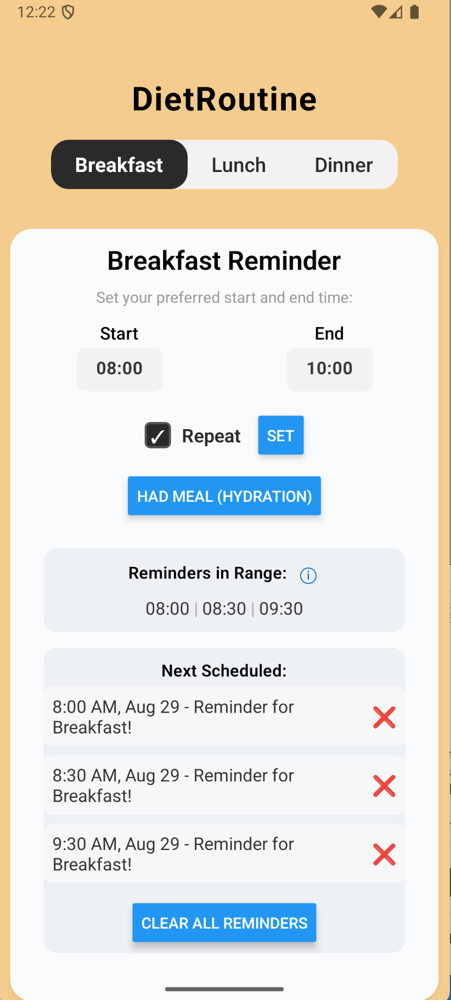
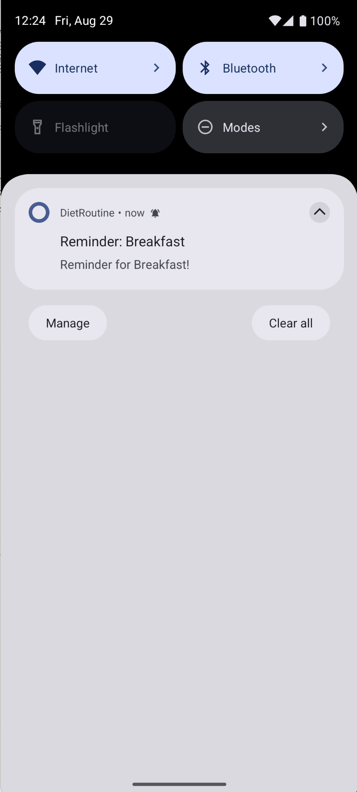
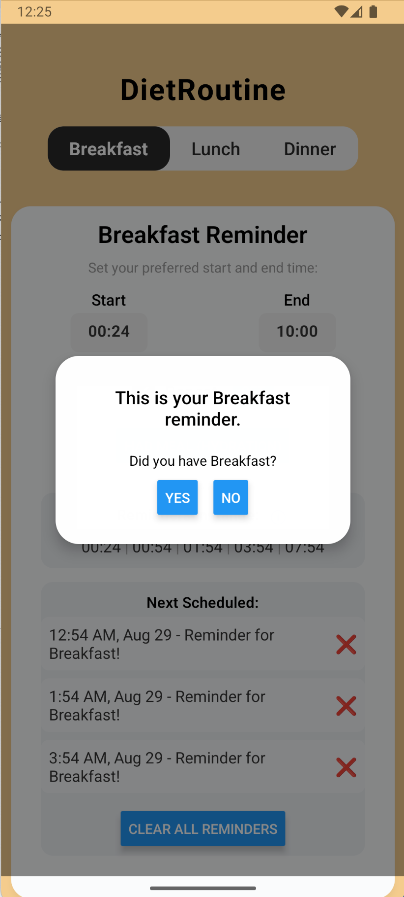
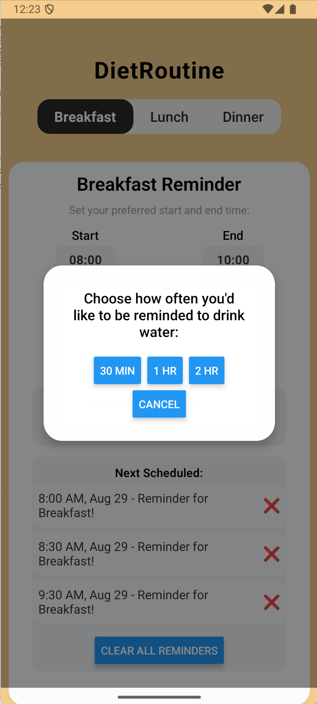

# DietRoutine

**DietRoutine** is a minimal, elegant cross-platform mobile app to help users optimize their daily meal and hydration routine, built with React Native (Expo) for both Android and iOS.

---

## Features

- **Smart Reminders**: Set customizable reminders for Breakfast, Lunch, and Dinner. Each tab lets you choose preferred start and end times.
- **Exponential Intervals**: App schedules reminders with growing intervals (starting at 30 minutes), so you won't miss a meal.
- **Hydration Prompts**: After confirming you had a meal, choose to receive two hydration reminders, with flexible interval selection (30 min, 1 hr, 2 hr).
- **Meal Logging**: Tap “Had Meal” to log meals and optionally trigger hydration reminders.
- **Suggestions**: If you skip a meal, the app suggests healthy dishes and simple recipes tailored for Breakfast, Lunch, and Dinner.
- **Persistent Settings**: All preferences and reminder times are saved — your routine adapts to your schedule.
- **Repeat Option**: Easily enable repeating reminders for up to 14 days ahead for recurring routines.
- **Reminder Management**: View all "Reminders in Range" in a compact row; see up to 3 next reminders, and delete individual or all reminders for a meal.
- **Custom Color Themes**: Each meal tab uses a distinctive pastel color for a clean, modern look (easily adjustable).
- **Battery Optimization Notice**: On first launch, prompts user to disable battery optimization for reliable background notifications.
- **Intentional UX**: Minimal UI, large buttons, prompt dialogs, centered messages, and tight layout for usability.

---

## UI Overview

### Home Tabs

- 3 tabs: Breakfast, Lunch, Dinner
- Each shows a reminder card with:
  - Start/End time pickers
  - “Repeat” toggle, **Manual “Had Meal (Hydration)”** button, and **Set** button
  - “Reminders in Range” (horizontal list of times)
  - “Next Scheduled” (the three upcoming reminders)

### Dialogs & Modals

- **Meal reminder:** “Did you have Breakfast?” → Tap Yes/No for further options.
- **Hydration popup:** “Choose how often you'd like to be reminded to drink water” (30min, 1hr, 2hr options)
- **Suggestions modal:** Shows dish/recipe suggestions if you skip a meal.
- **Battery prompt:** Advises disabling OS optimizations for background operation (on first launch)

---

## Demo Screenshots

> *Add screenshots of the main UI here:*
>
> 
> 
> 
> 
>
> *(To add: run the app, take screenshots with your device/emulator, and save them in the assets/ directory.)*

---

## Installation & Running

1. **Clone/Download this repo**  
2. **Install Dependencies**
   ```bash
   cd DietRoutine
   npm install
   ```

3. **Start (Dev)**
   ```bash
   npm run start
   ```
   or  
   ```bash
   npx expo start
   ```
   Then scan the QR code in the Expo Go app (Android/iOS).

4. **Build Standalone**
   ```bash
   npx eas build --platform android
   npx eas build --platform ios
   ```
   *(Requires EAS account and setup for App Store/Play Store builds)*

---

## Customization

- **Colors:**  
  Edit meal colors in `MEAL_COLORS` (`App.js`) or styles at the end of the file.
- **Notification Timing:**  
  Change default times/intervals in the reminder scheduling logic.
- **Icons, Splash:**  
  Replace assets in `assets/`.

---

## Known Issues/Limitations

- “Choose notification sound” per device is not yet implemented.
- Cannot sync reminders to system calendar.
- Works best when battery optimization is disabled in OS settings.

---

## License

MIT
